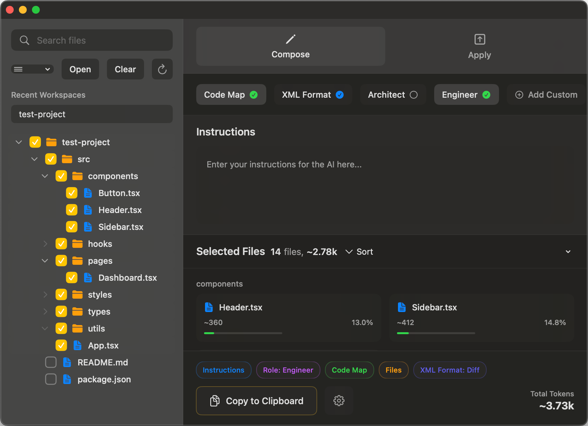

<div align="center">


# Repomax

</div>

**Repomax** is a powerful macOS application designed to assist developers with AI-powered code understanding, generation, and modification. It provides an intuitive suite of tools to manage codebases, interact with AI models using configurable roles, and apply changes with a comprehensive review process.

---

## ✨ Features

### 🎯 **Dual Pane Interface**
A familiar sidebar for file navigation and a main content area for AI interaction.

### 📝 **Compose Mode**
- 📁 Select files and folders for AI analysis
- ✍️ Craft prompts with specific instructions  
- 🎭 Choose AI roles (Architect, Engineer, or custom-defined roles) to tailor AI responses
- 📊 View token counts for selected files
- 🗺️ Toggle options for including a code map or formatting output as XML (Diff or Whole file)
- 📋 Copy composed prompts and file contexts to the clipboard with configurable settings

### ⚡ **Apply Mode**
- 👀 View AI-generated code responses
- 🔍 Review and apply proposed code changes
- ↩️ Undo applied changes

### 📂 **File Management**
- 🌳 File tree explorer with search functionality
- 📁 Open folders and manage recent workspaces
- 🚫 Support for `.repo_ignore` (local) and global ignore patterns, similar to `.gitignore`
- 🔄 Refresh file tree and clear selections

### 🔄 **Code Change Management**
- 📋 Modal view to review pending changes (Create, Modify, Delete) before applying
- ✅ Select individual file changes to apply or discard

### ⚙️ **Customization**
- 🎭 Add and manage custom AI role prompts
- 📋 Configure clipboard settings for copying content
- 🌳 Manage file tree display options and code map usage
- 🚫 Edit ignore patterns for local and global scopes

### 💾 **Persistence**
Uses Core Data for managing application data like recent workspaces and custom roles.

---

## 📸 Screenshots

<div align="center">



*Repomax in action - managing code files and AI interactions*

</div>

---

## 📁 Directory Structure

```
repomax/
├── 📁 Views/                    # UI components and view logic
│   ├── 📄 ContentView.swift         # Main UI layout and logic (1700+ lines)
│   ├── 📄 RolePromptSelectorView.swift
│   ├── 📄 MergeModalView.swift
│   ├── 📄 IgnorePatternsView.swift
│   ├── 📄 FileTreeOptionsView.swift
│   └── 📄 ClipboardSettingsView.swift
├── 📁 Models/                   # Data models and state management
│   ├── 📄 AppState.swift            # Central state management (900+ lines)
│   └── 📄 Persistence.swift         # Core Data stack management
├── 📁 Utilities/                # Helper classes and utilities
│   └── 📄 GitignoreParser.swift     # .gitignore pattern parsing
├── 📁 Resources/                # App resources and assets
├── 📁 Preview Content/          # SwiftUI preview assets
└── 📄 repomax.xcdatamodeld/     # Core Data model definition
```

---

## 🏗️ Project Structure Overview

The application is built with **SwiftUI for macOS**, following a clean architecture with separated concerns:

### 🎨 **Views Layer**
- **`ContentView.swift`** - The main UI layout component (1700+ lines) that:
  - Implements the dual-pane interface with sidebar and main content
  - Manages tab bar for Compose/Apply modes
  - Coordinates all modal presentations
  - Contains nested views for file tree, compose, and apply functionalities

- **Supporting Views:**
  - `RolePromptSelectorView` - AI role management interface
  - `MergeModalView` - Code change review and application
  - `IgnorePatternsView` - Pattern management for file filtering
  - `FileTreeOptionsView` - File tree display configuration
  - `ClipboardSettingsView` - Clipboard content management

### 🧠 **State Management**
- **`AppState.swift`** - A comprehensive state manager (900+ lines) handling:
  - UI state coordination
  - File operations and selections
  - AI interactions and response processing
  - Settings and configuration management
  - Change tracking and application

### 💾 **Data Layer**
- **`Persistence.swift`** - Core Data stack configuration and management
- **`repomax.xcdatamodeld`** - Data model definitions for persistence
- **`GitignoreParser.swift`** - Utility for parsing and applying ignore patterns

---

## 🚀 Getting Started

1. **Prerequisites:** Ensure you have Xcode installed on your macOS system
2. **Clone:** `git clone [repository-url]`
3. **Open:** Launch `repomax.xcodeproj` in Xcode
4. **Build & Run:** Target a Mac running macOS 14 (Sonoma) or later

---

## ⚙️ Technical Details

| Component | Technology |
|-----------|------------|
| **Framework** | SwiftUI |
| **Language** | Swift |
| **Target OS** | macOS 14 (Sonoma) and later |
| **Data Persistence** | Core Data |
| **Security** | App Sandbox enabled with read-only file access |
| **Testing** | Unit tests (`repomaxTests/`) and UI tests (`repomaxUITests/`) |

---

## 💻 Development Notes

- 🎯 **Best Practices:** Follows SwiftUI best practices with declarative UI and state management
- 📏 **Code Size:** Key components like `ContentView` and `AppState` are substantial and might benefit from further modularization
- 💾 **Data Storage:** Uses Core Data with well-defined models for workspaces and custom roles
- 🗂️ **Organization:** Clean directory structure (Views, Models, Utilities) for maintainability

---

## 📄 License

This project is licensed under the **MIT License** - see below for details:

```
MIT License

Copyright (c) 2024 Fomoroller

Permission is hereby granted, free of charge, to any person obtaining a copy
of this software and associated documentation files (the "Software"), to deal
in the Software without restriction, including without limitation the rights
to use, copy, modify, merge, publish, distribute, sublicense, and/or sell
copies of the Software, and to permit persons to whom the Software is
furnished to do so, subject to the following conditions:

The above copyright notice and this permission notice shall be included in all
copies or substantial portions of the Software.

THE SOFTWARE IS PROVIDED "AS IS", WITHOUT WARRANTY OF ANY KIND, EXPRESS OR
IMPLIED, INCLUDING BUT NOT LIMITED TO THE WARRANTIES OF MERCHANTABILITY,
FITNESS FOR A PARTICULAR PURPOSE AND NONINFRINGEMENT. IN NO EVENT SHALL THE
AUTHORS OR COPYRIGHT HOLDERS BE LIABLE FOR ANY CLAIM, DAMAGES OR OTHER
LIABILITY, WHETHER IN AN ACTION OF CONTRACT, TORT OR OTHERWISE, ARISING FROM,
OUT OF OR IN CONNECTION WITH THE SOFTWARE OR THE USE OR OTHER DEALINGS IN THE
SOFTWARE.
```

---

<div align="center">

**Made with ❤️ for developers who want to supercharge their coding workflow with AI**

</div> 